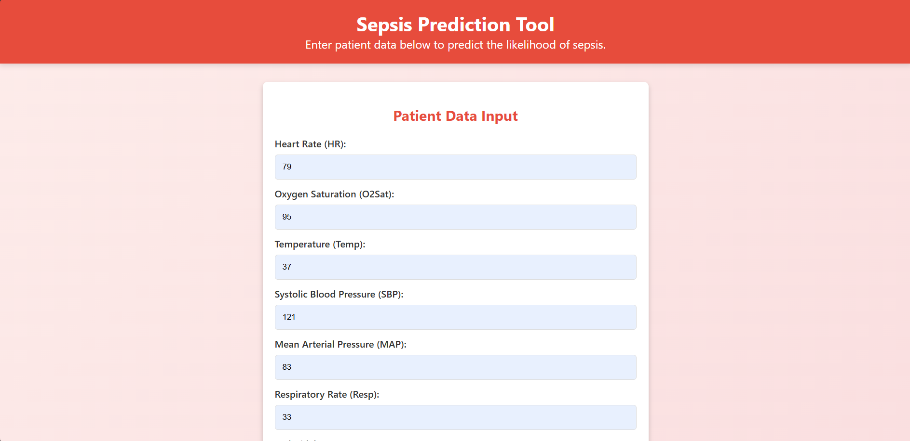
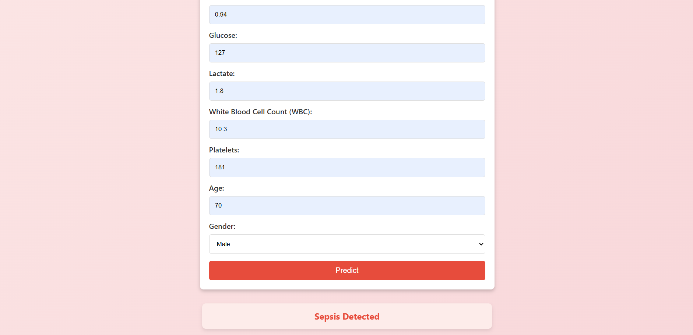

# <p align="center"> Sepsis prediction system based on patients vital signs </p>

This sepsis prediction system enables healthcare professionals to assess a patient’s risk of sepsis by inputting clinical data into a user-friendly web interface. Using a trained machine learning model on the backend, the system analyzes vital signs and lab results to determine if a patient is at risk of developing sepsis, aiding in early diagnosis and intervention.

## Features

1. **Tailored Sepsis Risk Assessment** Provides personalized sepsis risk predictions based on individual patient health profiles and clinical parameters.
2. **Machine Learning Algorithms:** Utilizes advanced machine learning models to analyze data and deliver accurate sepsis risk evaluations, supporting early intervention.
3. **User-Friendly Interface:** Ensures a streamlined, intuitive interface for healthcare providers, allowing quick and easy patient data entry.

## Requirements
1. Python 3.x: For the development of the project.
2. Essential Python Packages: Includes libraries such as pandas, numpy, scikit-learn for data handling and machine learning functionalities.

## Flow chart:


## Installation:
1. Clone the repository :
```
git clone https://github.com/Saravana-Kumar07/Sepsis-prediction-system-based-on-patients-vital-signs.git
```
2. Install the required packages.
3. Download the pre-trained Sepsis prediction model and label mappings.

## Program:
```python
import pandas as pd
import seaborn as sns
import matplotlib.pyplot as plt
from sklearn.model_selection import train_test_split
from sklearn.ensemble import RandomForestClassifier
from xgboost import XGBClassifier
from sklearn.svm import SVC
from sklearn.metrics import accuracy_score, precision_score, recall_score, f1_score, roc_auc_score, confusion_matrix, classification_report
from sklearn.ensemble import VotingClassifier
from sklearn.tree import DecisionTreeClassifier
from sklearn.metrics import ConfusionMatrixDisplay
import matplotlib.pyplot as plt
import joblib


file_path = 'Dataset.csv'
data = pd.read_csv(file_path)
df.head(10)
# Data preprocessing
columns_to_keep = [
    'Patient_ID',
    'HR', 'O2Sat', 'Temp', 'SBP', 'MAP', 'Resp', 'EtCO2',
    'BaseExcess', 'HCO3', 'FiO2', 'pH', 'PaCO2', 'BUN', 'Creatinine',
    'Glucose', 'Lactate', 'WBC', 'Platelets',
    'Age', 'Gender', 'HospAdmTime',
    'SepsisLabel'
]

data = data[columns_to_keep]

data.fillna(data.median(), inplace=True)
data = data.groupby('Patient_ID').head(12)

# Save the modified dataset
output_path = 'Modified_Dataset.csv'
data.to_csv(output_path, index=False)
data.head(20)

file_path = 'Modified_Dataset.csv'
data = pd.read_csv(file_path)

unique_patient_ids = data['Patient_ID'].unique()

# Sample 20,000 unique patients
sampled_patient_ids = pd.Series(unique_patient_ids).sample(n=20000, random_state=42)

# Filter the dataset to include only the rows with the sampled patient IDs
reduced_data = data[data['Patient_ID'].isin(sampled_patient_ids)]

output_path = 'Reduced_Dataset_20000_Patients_1.csv'
reduced_data.to_csv(output_path, index=False)

data_path = '/content/Reduced_Dataset_20000_Patients_1.csv'
data = pd.read_csv(data_path)

# Proceed with the rest of your code as before
X = data.drop(columns=['SepsisLabel','Patient_ID', 'HospAdmTime'])
y = data['SepsisLabel']

# Visualize Correlation
plt.figure(figsize=(12, 10))
sns.heatmap(X.corr(), annot=True, fmt=".2f", cmap="coolwarm")
plt.title("Feature Correlation Heatmap")
plt.show()

X_train, X_test, y_train, y_test = train_test_split(X, y, test_size=0.2, random_state=42)

rf_model = RandomForestClassifier(random_state=42)
xgb_model = XGBClassifier(eval_metric='logloss', random_state=42)
dt_model = DecisionTreeClassifier(random_state=42)

ensemble_model = VotingClassifier(estimators=[
    ('rf', rf_model),
    ('xgb', xgb_model),
    ('dt', dt_model)
], voting='soft')

# Fit the ensemble model
ensemble_model.fit(X_train, y_train)

# 4. Model Evaluation
models = {
    'Random Forest': rf_model,
    'XGBoost': xgb_model,
    'Decision Tree': dt_model,
    'Ensemble Model': ensemble_model
}

# Fit individual models before evaluation if not already fitted within the ensemble
for model_name, model in models.items():
    if model_name != 'Ensemble Model' and not hasattr(model, 'estimators_'): 
        model.fit(X_train, y_train)

    # Predict on the test set
    y_pred = model.predict(X_test)
    y_proba = model.predict_proba(X_test)[:, 1] if hasattr(model, "predict_proba") else None
    # Calculate evaluation metrics
    accuracy = accuracy_score(y_test, y_pred)
    precision = precision_score(y_test, y_pred)
    recall = recall_score(y_test, y_pred)
    f1 = f1_score(y_test, y_pred)
    auc = roc_auc_score(y_test, y_proba) if y_proba is not None else "N/A"

    # Print the results
    print(f"Model: {model_name}")
    print(f"Accuracy: {accuracy:.2f}")
    print(f"Precision: {precision:.2f}")
    print(f"Recall: {recall:.2f}")
    print(f"F1 Score: {f1:.2f}")
    print(f"AUC: {auc:.2f}")
    print("\n" + "="*40 + "\n")

# 5. Visualize Confusion Matrix for Ensemble Model
!pip install -U scikit-learn
from sklearn.metrics import ConfusionMatrixDisplay
import matplotlib.pyplot as plt
disp = ConfusionMatrixDisplay.from_estimator(ensemble_model, X_test, y_test, cmap="Blues")

disp.ax_.set_title("Confusion Matrix - Ensemble Model")
plt.show()

#save the model
joblib.dump(ensemble_model, 'sepsis_model1.pkl')

```

## Output:
Sepsis Prediction System





## Result:
The sepsis prediction model, built using ensemble learning, demonstrates robust performance on both training and testing sets:

1. The model achieved an impressive accuracy of 98%, showcasing its effectiveness in accurately predicting sepsis risk.
2. The AUC score, which reflects the model's ability to distinguish between sepsis and non-sepsis cases, is 86%, indicating strong overall classification performance.
3. Ensemble learning outperformed individual models, including Random Forest, XGBoost, and Decision Tree classifiers, delivering the best results across all metrics.

These results highlight the model’s high accuracy and AUC, making it a reliable tool for early sepsis detection.